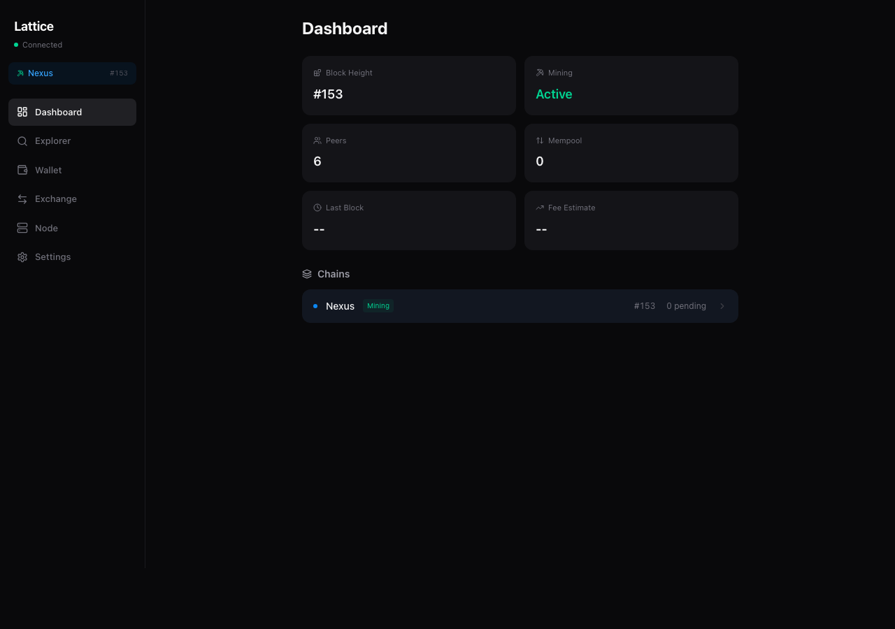
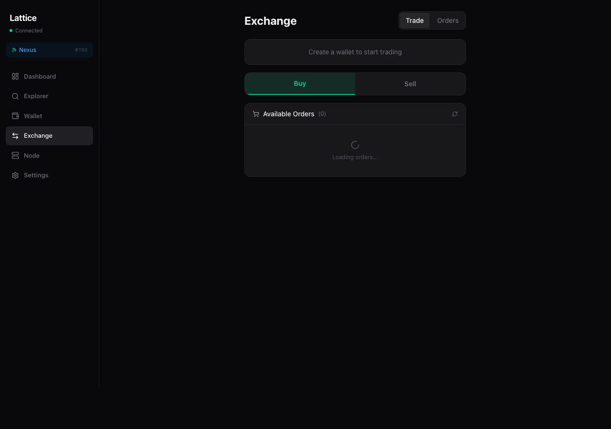
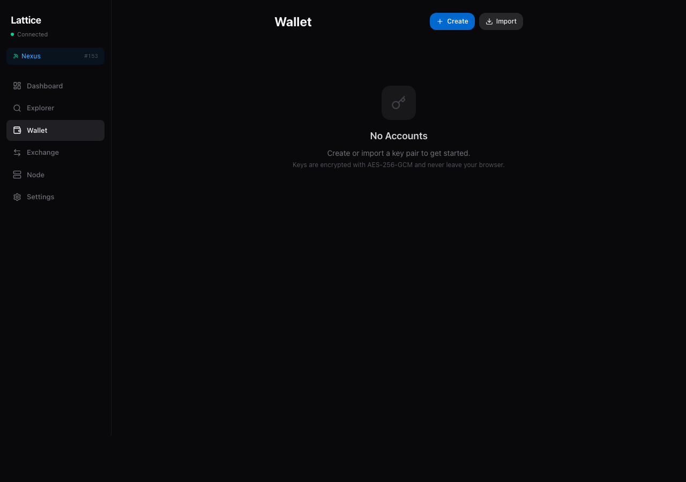
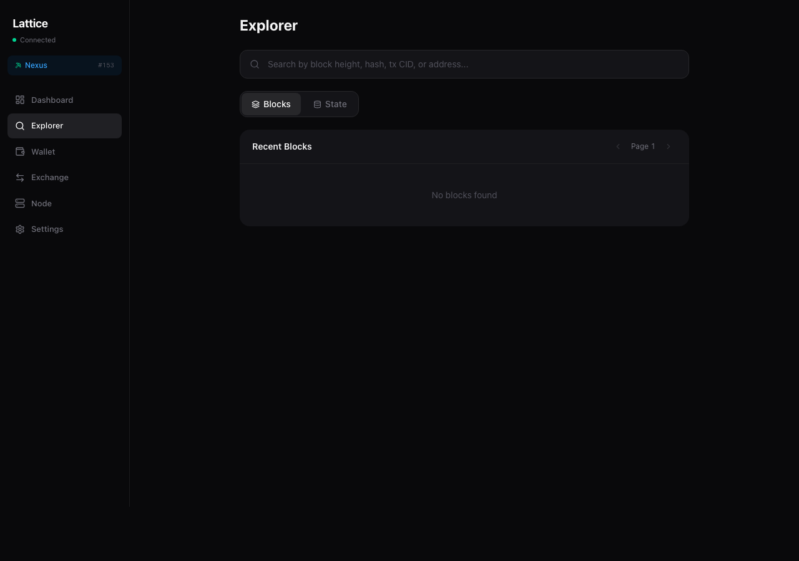
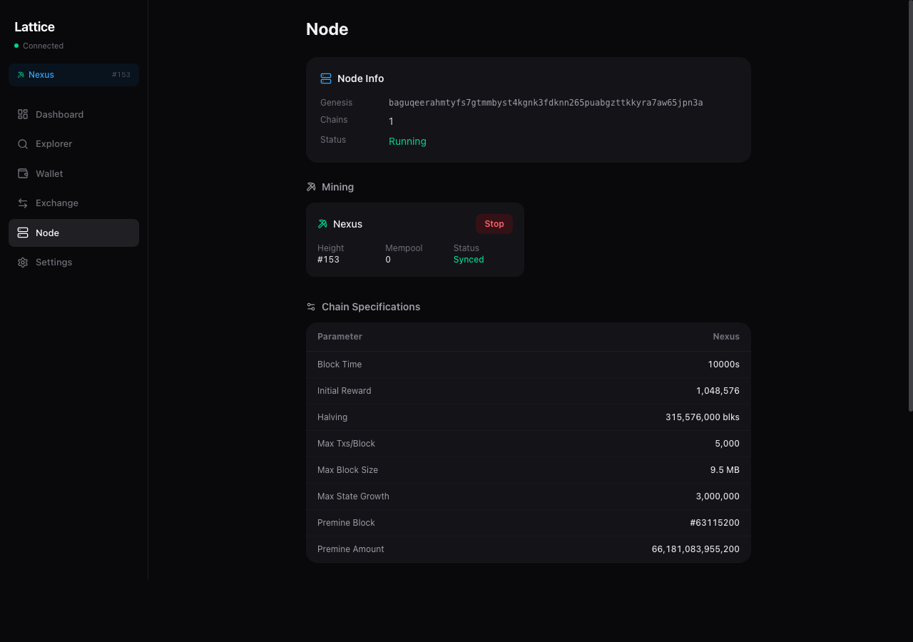
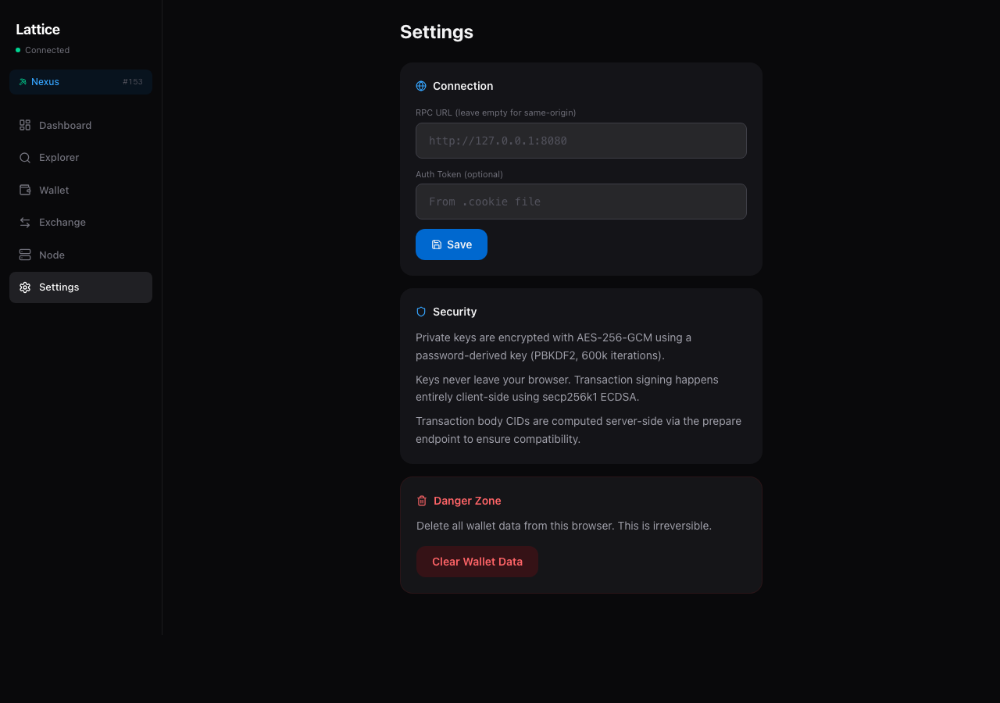

# Lattice

A browser-based client for the [Lattice](https://github.com/treehauslabs/lattice-node) blockchain network. Manage wallets, trade across chains, explore blocks, and control your node — all from a single interface.

Private keys never leave your browser. Transactions are signed client-side with secp256k1 ECDSA. Keys are encrypted at rest with AES-256-GCM (PBKDF2, 600k iterations).

## Screenshots

| Dashboard | Exchange |
|:-:|:-:|
|  |  |

| Wallet | Explorer |
|:-:|:-:|
|  |  |

| Node Control | Settings |
|:-:|:-:|
|  |  |

## Quick Start

Start a Lattice node with the RPC server enabled:

```bash
lattice-node --rpc-port 8080
```

Then run the app:

```bash
npm install
npm run dev
```

Open [localhost:3000](http://localhost:3000). The app auto-connects to the node and streams chain state in real time.

## Example: Cross-Chain Atomic Swap

Lattice supports trustless cross-chain trading via a 3-step atomic protocol (Deposit, Receipt, Withdrawal). The Exchange tab makes this a one-click operation:

**1. Create a sell order (Deposit)**

A miner on the `Gold` child chain wants to sell 500 Gold for 10,000 Nexus tokens. They go to Exchange > Sell, enter the amount and asking price, and confirm. This creates a deposit on the Gold chain that locks the tokens until someone fills it.

**2. Fill the order (one click)**

A buyer browsing the order book sees the offer and clicks **Fill**. Behind the scenes, the app automatically chains two transactions:
- **Receipt** on the Nexus chain — locks the buyer's 10,000 Nexus as payment
- **Withdrawal** on the Gold chain — claims the 500 Gold using the receipt proof

The buyer sees a live progress indicator as each step confirms. No manual coordination needed.

**3. Seller claims payment**

The seller returns to the Exchange > Orders tab, sees the completed receipt, and clicks **Withdraw** to claim their 10,000 Nexus from the Nexus chain.

The entire exchange is trustless — funds are locked in on-chain deposits at every step, and either party can reclaim if the counterparty disappears.

## Architecture

```
lattice-app (this repo)          lattice-node
┌─────────────────────┐          ┌──────────────────┐
│  React 19 + Vite 6  │── RPC ──▶│  Hummingbird HTTP │
│  Tailwind CSS 4     │          │  Swift 6          │
│                     │          │                   │
│  secp256k1 signing  │          │  Nexus chain      │
│  AES-256-GCM keys   │          │  Child chains     │
│  Client-side only   │          │  Merged mining    │
└─────────────────────┘          └──────────────────┘
```

- **Dashboard** — portfolio balances, block height, mining status, peer count, fee estimates
- **Explorer** — browse blocks, inspect transactions and CID references, query account state
- **Wallet** — create/import keys, send tokens, per-chain balance breakdown
- **Exchange** — cross-chain atomic swaps with one-click order filling
- **Node** — start/stop mining, view chain specs, monitor peers
- **Settings** — RPC endpoint, auth token, wallet management

## Development

```bash
npm run dev       # dev server on :3000, proxies /api to :8080
npm run build     # production build
npm run preview   # preview production build
```

Built with React 19, Vite 6, Tailwind CSS 4, and [noble](https://github.com/paulmillr/noble-secp256k1) for cryptography.
